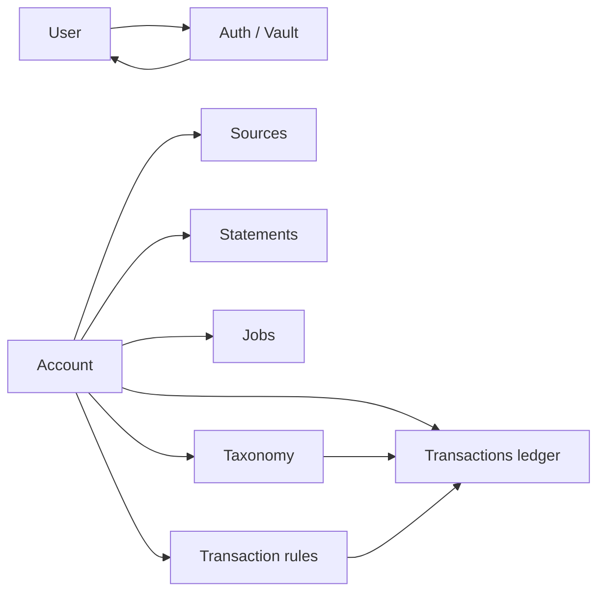

# ADR-001: Domain-Driven Design and Clean Architecture

## Status

Accepted

## Context

NetworthDB owns account metadata, authentication, statement processing, and background jobs. Business rules must stay independent of HTTP, databases, and third-party integrations. Dependencies must point inward: outer layers depend on the domain, never the reverse.

## Decision

Adopt **Domain-Driven Design** with **Clean Architecture**. The domain package (`@ndb/core`) sits at the center; apps and infrastructure adapters wrap it.

```mermaid
flowchart TB
  subgraph apps [Apps]
    API[HTTP API]
    Web[Web UI]
    Copilot[MCP Copilot]
  end

  subgraph composition [Composition]
    Bootstrap[@ndb/bootstrap]
    Platform[@ndb/platform]
  end

  subgraph domain [Domain center]
    Core[@ndb/core]
  end

  subgraph infra [Infrastructure]
    DB[@ndb/database]
    Stmt[@ndb/statements]
    Auth[@ndb/auth]
    Enc[@ndb/encryption]
    MW[@ndb/middleware]
    Log[@ndb/logger]
    Mail[@ndb/notifications]
  end

  API --> Bootstrap
  Web --> Platform
  Copilot --> Platform
  Bootstrap --> Core
  Bootstrap --> DB
  Bootstrap --> Stmt
  Bootstrap --> Auth
  Bootstrap --> Enc
  DB --> Core
  Stmt --> Core
  Auth --> Core
  Auth --> Enc
  DB --> Enc
  Stmt --> Enc
  API --> MW
```

### Bounded Contexts



| Context | Scope |
| ------- | ----- |
| User | Identity and profile |
| Auth / Vault | Login, MFA, sessions, recovery, vault slots |
| Account | Account metadata, statement orchestration, SQL ledger (transactions submodule), taxonomy (categories/tags submodule), and transaction rules submodule |
| Sources | Mail and statement source configuration |
| Statements | Vault-backed statement artifacts (no SQL entity for individual statements) |
| Transactions | Ledger rows, import batches, and monthly summaries (SQL; owned by Account) |
| Transaction rules | User rule groups, triggers, and actions on ledger facts (owned by Account) |
| Jobs | Background work tied to accounts and pipelines |

### Web Information Architecture

The web app uses a single **Accounts** navigation entry (`/accounts`) with statement files, coverage, and calendar on a child route (`/accounts/:accountId/statements`). **Statements** remains a bounded context for vault-backed artifacts; it is not a separate top-level sidebar area. HTTP statement and account APIs are unchanged—only client routing and layout were consolidated.

### Dependency Rules

- Apps depend on bootstrap and platform schemas, not on adapter internals.
- Domain does not import persistence, HTTP, or compute packages.
- Bootstrap wires port implementations; cross-cutting HTTP concerns stay in middleware.

## Consequences

### Positive

- Business rules are testable without HTTP or a database.
- Adapters (storage, compute, auth) can be swapped behind ports.

### Negative

- Shared type changes start in the domain and propagate to adapters.
- More packages and explicit wiring than a monolith.

### Neutral

- API request/response shapes are defined separately from domain entities and mapped at the boundary.

## References

- [ADR-002](002-authentication.md) — auth bounded context
- [ADR-004](004-data-encryption-policy.md) — field classification
- [Statement compute](../../src/packages/statements/README.md)
- [ADR-006](006-transactions-ledger.md) — transactions ledger
- [ADR-007](007-transaction-taxonomy.md) — categories and tags
- [ADR-009](009-transaction-rules-engine.md) — transaction rules engine
- [ADR-010](010-mcp-copilot.md) — MCP copilot host
