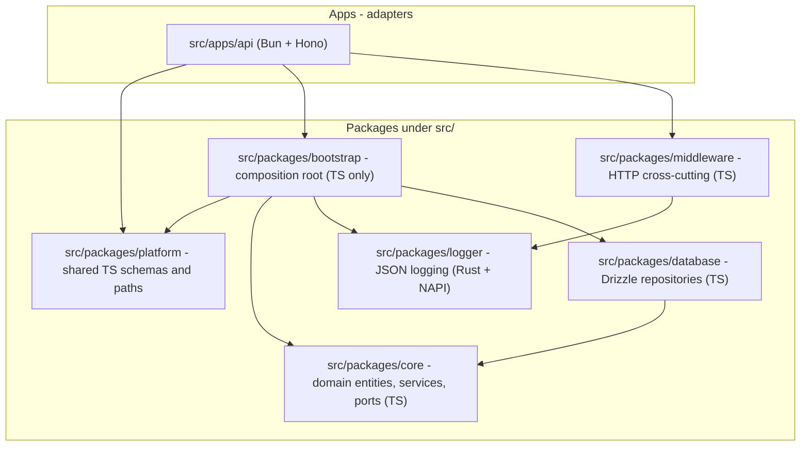

# ADR-001: Domain-Driven Design and Clean Architecture

## Status

Accepted

## Context

NetworthDB is the backend for account metadata and authentication. Business logic
must stay independent of HTTP (Hono, Bun) and infrastructure (Postgres, NAPI).
Dependencies point inward: adapters depend on the domain, never the reverse.

The domain layer is **TypeScript** (`@ndb/core`). Layout mirrors Argus
`@argus/core`: bounded contexts under `domains/`, shared cross-cutting utilities,
and repository ports separate from Drizzle adapters.

Rust is used only where native performance or single-writer semantics matter:
`@ndb/logger` today; future compute packages (e.g. NetworthCSV) follow the
same NAPI pattern. All application and library code lives under `src/`.

## Decision

We use the following layers and dependency direction:

### Layer responsibilities

- **`src/packages/core`** — the domain center. Organized as bounded contexts under
  `src/domains/` (`user/`, `auth/`, …), each with `entities/`, `repositories/`,
  `services/`, and optional `embedded/` for pure protocol logic. Cross-cutting
  domain errors live in `src/shared/errors/`. No Drizzle, Hono, env parsing, or
  logging.

- **`src/packages/logger`** — the single JSON log writer (Rust + NAPI). Callers use
  `createLogger()` from `@ndb/logger`. Console routing
  lives in Rust `backend/`. Rejects empty messages, attaches `rayId`, writes one JSON object per line. Other Rust workspace members use the `logger` crate via Cargo.

- **`src/packages/database`** — persistence infrastructure. Drizzle schema and
  repository implementations. Depends on `@ndb/core`. Layout: `drizzle/` holds
  migrations; `src/schema/` holds Drizzle table definitions;
  `src/repositories/` holds adapters that map rows into core entities.

- **`src/packages/middleware`** — HTTP cross-cutting concerns (CORS, error handler,
  request logging, request context). Depends on `@ndb/logger` and
  `@ndb/platform`.

- **`src/packages/platform`** — transport-agnostic TypeScript contracts: Zod
  schemas, API path constants, client-safe types. Must never import native addons.

- **`src/packages/bootstrap`** — composition root. TypeScript only: `loadConfig`,
  `loadApiRuntime`, and service handles. Wires database pool, logger, and domain
  services.

- **`src/apps/api`** — HTTP adapter. Calls `loadApiRuntime()` from bootstrap.
  Maps routes to services, applies middleware, translates domain errors to HTTP.

### NAPI compute packages (future)

Packages like NetworthCSV are self-contained Rust + NAPI workspace members:

- Accept collected input, run heavy computation, return typed output
- No database connections, no HTTP
- Other packages import `@ndb/<package>` normally

### Dependency rules

| From | May depend on | Must not depend on |
| ---- | ------------- | ------------------ |
| `core` | (stdlib, crypto npm libs) | `database`, `logger`, `middleware`, Hono, apps |
| `database` | `core` | `bootstrap`, `middleware`, Hono, apps |
| `logger` | (Rust stdlib) | `core`, `database`, Hono |
| `middleware` | `logger`, `platform`, Hono | `database`, apps |
| `bootstrap` | `core`, `database`, `logger`, `middleware`, `platform` | Hono, apps |
| `platform` | (TS stdlib / Zod) | native addons, Hono |
| `apps/api` | `bootstrap`, `middleware`, `platform`, Hono | `@ndb/logger` |

Pool and connection wiring belong in bootstrap (`loadApiRuntime`), not in route
handlers or `core`.

### Adding a new domain feature

1. **Model in `core`** — entities, value objects, domain errors, repository ports,
   application services under `src/domains/<name>/`.
2. **Implement in `database`** — Drizzle adapters that satisfy core repository ports.
3. **Expose through `bootstrap`** — register services in `src/services/`.
4. **Adapt in `apps/api`** — Hono routes call `loadApiRuntime().services`.

## Consequences

### Positive

- Consistent Argus-style structure: thin HTTP apps, one composition root.
- Domain logic unit-testable with bun test — no database or HTTP for core tests.
- Logger and future compute packages stay in native code without coupling to HTTP/DB.
- `@ndb/platform` stays safe for future frontend imports.

### Negative

- NAPI packages require a Rust rebuild (`make install`) when native code changes.
- Splitting domain (TS) from compute (Rust NAPI) requires clear input/output contracts.

### Neutral

- Auth middleware can move to `@ndb/middleware` as features grow.

## Alternatives Considered

### Rust domain layer (previous design)

Rust `kernel` + `database` crates with a single bootstrap NAPI addon. Replaced because
most application logic benefits from Bun/TypeScript velocity; only logger and future
compute workloads need native code.

### TypeScript-only logger

Rejected: Rust logger provides single-writer JSON semantics and prepares for
CloudWatch backend without blocking the event loop.

## References

- [ADR-002](002-authentication.md) — authentication, MFA, sessions, recovery
- [ADR-003](003-end-to-end-encryption.md) — client-side end-to-end encryption
- [DEV.md](../DEV.md) — setup, make targets, bootstrap wiring
- [NAPI-RS](https://napi.rs/)
- [Hono](https://hono.dev/)
- [Drizzle ORM](https://orm.drizzle.team/)
