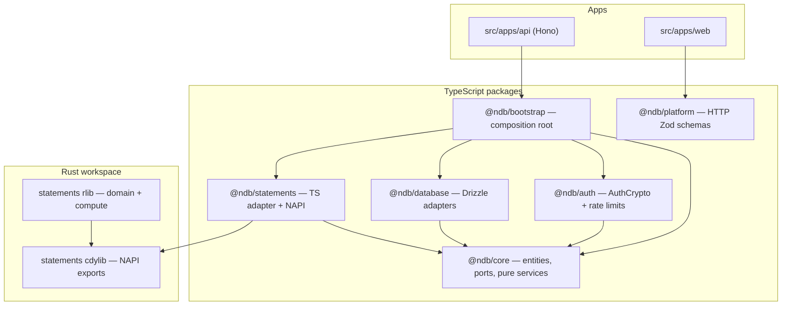

# ADR-001: Domain-Driven Design and Clean Architecture

## Status

Accepted (updated for TypeScript-only core — see ADR-006)

## Context

NetworthDB is the backend for account metadata, statement compute, and authentication.
Business rules for accounts, statements, sources, and jobs must stay independent of HTTP
(Hono) and persistence (Drizzle). Dependencies point inward: adapters depend on domain
code, never the reverse.

Domain entities are defined in TypeScript (`@ndb/core` `src/domains/`). Statement compute
runs in Rust (`@ndb/statements`) behind `StatementEngine`. Auth ceremonies run in
`@ndb/auth` (see ADR-006).

## Decision

### Layer responsibilities

- **`@ndb/core` TypeScript** — bounded contexts for `user`, `auth`, `account`, `jobs`,
  `sources`. Entities, value objects, repository ports, pure application services
  (`AccountService`, `UserService`, …), and ports (`StatementEngine`). **No runtime
  npm dependencies.** See ADR-006.

- **`@ndb/auth` TypeScript** — crypto adapters: `createAuthCrypto()` implements
  `AuthCrypto` ports (Argon2, TOTP, WebAuthn RP, token digest, MFA secret box) plus Redis
  rate limits. Depends on `@ndb/core` and crypto libraries.

- **`@ndb/statements`** — statement compute (Rust rlib + `statements.node` cdylib) and
  TypeScript adapter (`createStatementEngine()` implements `StatementEngine`).

- **`statements` (rlib)** — NetworthCSV port: file layout, bank handlers, pipeline
  stages. `statements::domain` is internal Rust vocabulary; `domain::convert` maps vault
  JSON to domain read models.

- **`@ndb/platform`** — shared HTTP paths and Zod request/response schemas (snake_case
  JSON mapping only at the API boundary).

- **`src/apps/api`** — thin Hono routes: validate with platform schemas, call bootstrap
  services, serialize responses.

### Bounded contexts

| Context | Owner | Notes |
| --- | --- | --- |
| User | `@ndb/core` | Entities, admin CRUD via `UserService` |
| Auth / Vault | `@ndb/core` | `AuthService`, MFA, WebAuthn, recovery, `VaultService`; crypto via `@ndb/auth` |
| Account | `@ndb/core` | Entity + `AccountService`; Drizzle maps rows → `Account` |
| Sources | `@ndb/core` | Independent; not nested under account |
| Statements (compute) | Rust rlib + `@ndb/statements` adapter | Vault-backed; no SQL table for `Statement` |
| Jobs | `@ndb/core` | Entity + runner; `JobScope` references `accountId` |

### Dependency rules

- Apps import `@ndb/bootstrap` and `@ndb/platform`, not Drizzle or NAPI internals.
- `@ndb/core` does not import `@ndb/statements`, `@ndb/auth`, or `@ndb/database`.
- Bootstrap wires port implementations (`createStatementEngine`, `createAuthService`).
- `@ndb/database` implements core repository ports; no domain logic in repositories.

## Consequences

- Domain type changes start in TypeScript `@ndb/core` `src/domains/`, then update
  `statements::domain`, `napi/convert.rs`, and `@ndb/statements/src/convert/` when
  compute shapes change.
- Auth service changes stay in `@ndb/core`; crypto adapter changes stay in `@ndb/auth`.
- See ADR-005 for pipeline invocation and ADR-006 for the full type-ownership model.
