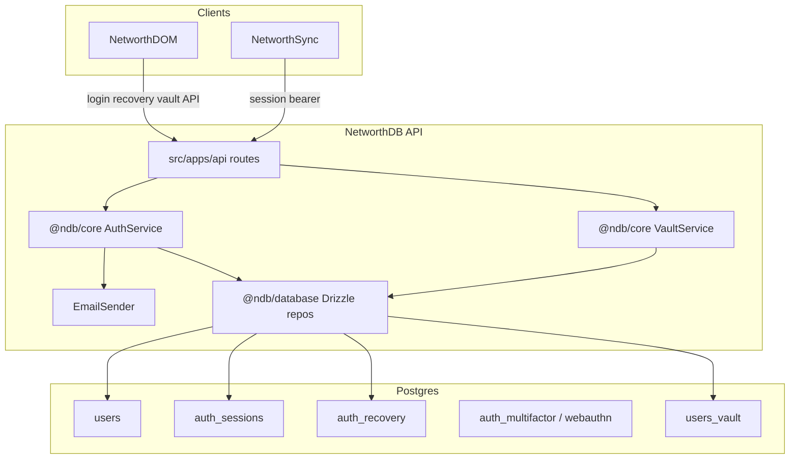

# ADR-002: Authentication

## Status

Accepted

## Context

NetworthDB is the consolidated backend for account metadata and authentication in
Financial Footprints. NetworthDOM authenticates users against this service;
NetworthSync and other backends validate session bearer tokens against the same
API.

Constraints that shaped this design:

- **Privacy** — username-only identity by default; recovery email is opt-in.
- **Defense in depth** — MFA for production roles; TOTP secrets encrypted at rest;
  opaque refresh tokens stored hashed and rotated on each use.
- **No silent admin reset** — administrators cannot clear MFA or reset passwords via
  admin APIs; advanced recovery is self-serve when vault data-recovery slots exist.
- **Data confidentiality boundary** — sensitive application data is encrypted in the
  client (NetworthDOM) before it reaches NetworthSync. NetworthDB provides standard
  authentication only.

## Decision

Adopt **standard authentication** with **optional email-assisted recovery**:

1. **Primary factor** — password login over TLS (`POST /api/v1/auth/login`). Server
   stores an Argon2id hash (`password_hash` on `users`) and verifies credentials on
   each login.
2. **Second factors** — TOTP and WebAuthn (hardware keys). Enforcement via
   `ENVIRONMENT` and `MFA_REQUIRED_ROLES`.
3. **MFA recovery codes** — optional one-time codes for lost authenticator scenarios.
4. **Optional recovery email** — stored as Argon2id hash of the normalized address
   (`recovery_email_hash`; never plaintext; never server-decryptable). Enrollment
   status on `GET /api/v1/users/me` only. See [ADR-003](003-end-to-end-encryption.md).
5. **Self-serve password reset** — for users who forgot their password but retain MFA.
   Email token plus MFA proof required.
6. **Advanced recovery** — for users who lost MFA (and optionally password).
   Self-serve when recovery email and a vault `recovery_phrase` or `webauthn_prf`
   slot exist: email token, client unlocks DEK, re-wraps password slot, MFA cleared,
   forced re-enrollment when policy requires.
7. **Sessions** — opaque `session_token` and `refresh_token` pairs stored hashed in
   `auth_sessions`; refresh rotated on each use; short `SESSION_TTL` on access tokens.
8. **Session revocation** — credential, role, username, MFA, and recovery-completion
   events revoke all sessions for the affected user.

### Non-goals

- Silent administrator MFA or password reset
- Email or SMS as a login OTP factor (email is recovery-only)
- Custom client-held identity signing keys
- Guarantee that a host operator cannot edit auth rows via direct database access

### Client-side data encryption (NetworthDOM / NetworthSync)

See **[ADR-003](003-end-to-end-encryption.md)** for the full design.

Sensitive payloads are encrypted in the browser before upload. Keys derive from the
user password (client KDF, separate from the login hash) and/or WebAuthn PRF vault
slots. Password reset restores login only; ciphertext sealed to prior data keys
remains unreadable until the client re-wraps data keys.

## Threat model

### Adversary

A host root or DevOps operator who can:

- Read and write NetworthDB and NetworthSync databases (often co-located)
- Read deployed configuration and key files on disk, including `MFA_ENCRYPTION_KEY`

### Assumptions

- Application builds ship via reviewed, immutable CI/CD; root does not substitute
  malicious binaries
- NetworthDOM pipeline is separate and honest
- End-user devices are outside this model

### Security goals

| Goal                                     | Mechanism                                                                                                                   |
| ---------------------------------------- | --------------------------------------------------------------------------------------------------------------------------- |
| Sensitive data not readable from DB/disk | Client-side encryption in DOM (password KDF and/or WebAuthn PRF) before data is stored in Sync                              |
| Standard login and authorization         | Password (Argon2id) + MFA (TOTP, WebAuthn) + server-validated session tokens                                                |
| Optional account recovery                | Opt-in recovery email; self-serve password reset with MFA proof; self-serve advanced recovery with vault data-recovery slot |

### Acceptable residuals

| Residual                                                                       | Consequence                                                        | Mitigation / rationale                                                                                                          |
| ------------------------------------------------------------------------------ | ------------------------------------------------------------------ | ------------------------------------------------------------------------------------------------------------------------------- |
| Password sent over TLS on login                                                | TLS compromise exposes credentials                                 | TLS is baseline; rate limiting and lockout reduce brute force                                                                    |
| Step-up password in JSON body                                                  | Infrequent re-auth sends password over TLS                         | Accepted residual for high-impact mutations                                                                                     |
| Auth rebinding — root rewrites `password_hash` and/or WebAuthn credential rows | Can obtain auth sessions as that user                              | Cannot decrypt application data sealed to the original user password or authenticator PRF secrets (ADR-003)                     |
| Stolen session token from DB or logs                                           | Attacker can act as user until token expires or is revoked         | Tokens stored hashed; short `SESSION_TTL`; logout and revocation events invalidate sessions                                     |
| Stale session after role demotion                                              | Brief window where session `acr` / role is outdated                | Sessions revoked on role change; short `SESSION_TTL` (accepted residual)                                                        |
| Password policy split by `ENVIRONMENT`                                         | Local accepts weak passwords for developer convenience             | `ENVIRONMENT=production` enforces ≥12 chars plus upper, lower, digit, and symbol; local is length-only (8–128)                  |
| Lost password and all MFA factors, no recovery email                           | Permanent lockout                                                  | Default privacy posture; users opt in to recovery email                                                                         |
| Email account compromise                                                       | Attacker may receive reset or advanced recovery links              | Self-serve reset requires MFA; advanced requires vault slot unlock client-side; short TTLs; rate limits — risk not eliminated   |
| Auth recovery ≠ data recovery                                                  | Password reset does not decrypt client-encrypted Sync data         | DOM must re-wrap data keys separately                                                                                           |
| Root / SQL bypass                                                              | Root can edit MFA or `password_hash` directly                      | Ceremony prevents API/UI silent reset, not raw DB access                                                                        |
| Admin social engineering                                                       | MFA can be cleared only via advanced recovery token + vault unlock | Self-serve path; vault slot required; short TTL; offline phrase/passkey unlock remains client-side                              |

## Architecture

| Component                          | Responsibility                                                |
| ---------------------------------- | ------------------------------------------------------------- |
| `src/apps/api` routes              | HTTP endpoints for login, MFA, recovery, and user management  |
| `@ndb/core` `AuthService`          | Login, session lifecycle, password updates, recovery          |
| `@ndb/core` `MultifactorService`   | TOTP, WebAuthn, recovery codes, lockout                       |
| `@ndb/core` `VaultService`         | Vault slot validation and persistence orchestration           |
| `EmailSender` port                 | SMTP or console delivery for recovery emails (no persistence) |
| `@ndb/database` Drizzle repositories | Persistence adapters for users, sessions, MFA, recovery, vault |

## Key design choices

| Choice                                       | Pros                                                               | Cons                                                             |
| -------------------------------------------- | ------------------------------------------------------------------ | ---------------------------------------------------------------- |
| Optional recovery email                      | Users can recover from single-factor loss                          | Privacy trade-off; email compromise risk                         |
| Self-serve advanced recovery with vault gate | No silent admin reset; data recovery when client unlocks DEK       | Requires vault `recovery_phrase` or `webauthn_prf` slot at begin |
| Self-serve reset requires MFA                | Stolen inbox alone is insufficient                                 | Useless if MFA is also lost (advanced path required)             |
| Hashed recovery email at rest                | DB leak does not expose addresses; begin requires re-entered email | User must supply email on each recovery start                    |
| No email by default                          | Strong username-only privacy                                       | No recovery without opt-in                                       |
| Opaque server-side sessions                  | Immediate revocation; no signing key exposure                      | Requires session lookup on each authenticated request            |

## Alternatives Considered

### No recovery (lockout only)

Rejected as sole option — optional email recovery added with documented risks.

### Admin MFA reset without user proof

Rejected — creates a support backdoor.

### Email/SMS login OTP

Rejected — privacy concern; unnecessary for recovery design.

## Consequences

### Positive

- Privacy-first username-only identity with opt-in recovery.
- Defense in depth via MFA, encrypted TOTP secrets, and session rotation.
- Clear separation between authentication recovery and data recovery (ADR-003).

### Negative

- Operators must configure recovery email delivery and understand residual risks.
- Session-based auth requires database lookup on each request (vs stateless JWT).

### Neutral

- API path constants live in `src/packages/platform/src/endpoints.ts`.

### Operators

- Set `MFA_ENCRYPTION_KEY` in production.
- Configure `SMTP_*` for recovery email delivery.
- Set `RECOVERY_APP_BASE_URL` for links in recovery emails.
- Understand the recovery vs data-recovery distinction and residuals above.

### NetworthDOM

- Opt-in recovery email UI; password and advanced recovery flows.
- Client-side vault and E2EE field handling per ADR-003; data-key re-wrap after
  password reset when required.

### NetworthSync

- Validate session bearer tokens against NetworthDB; enforce `acr=aal2` where
  appropriate.
- Stores opaque ciphertext for E2E-sealed fields; cannot decrypt.

## References

- [ADR-001](001-domain-driven-design.md) — domain and package layout
- [ADR-003](003-end-to-end-encryption.md) — client-side end-to-end encryption
- [DEV.md](../DEV.md) — setup, make targets, bootstrap wiring
- [`src/packages/platform/src/endpoints.ts`](../../src/packages/platform/src/endpoints.ts) — API path constants
- [`src/apps/api/.env.example`](../../src/apps/api/.env.example) — environment variable reference
