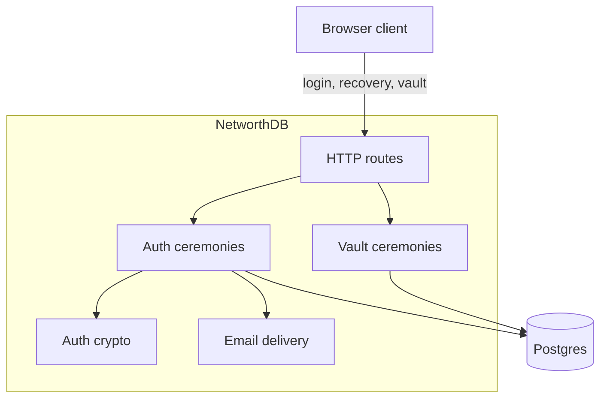
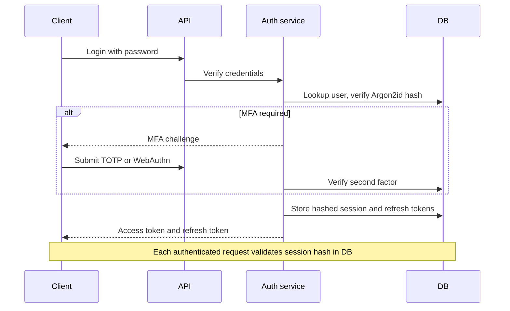

# ADR-002: Authentication

## Status

Accepted

## Context

NetworthDB is the consolidated backend for Financial Footprints. Clients authenticate against this API; every protected route validates session tokens here.

Design constraints:

- **Privacy** — username-only identity by default; recovery email is opt-in.
- **Defense in depth** — MFA for production roles; TOTP encrypted at rest; refresh tokens hashed and rotated.
- **No silent admin reset** — operators cannot clear MFA or reset passwords through admin APIs.
- **Auth ≠ data confidentiality** — tier-1 application data is client-encrypted per [ADR-003](003-end-to-end-encryption.md) and [ADR-004](004-data-encryption-policy.md).

## Decision

Adopt **standard server-side authentication** with **optional email-assisted recovery**:

1. **Primary factor** — password verified with Argon2id on each login.
2. **Second factors** — TOTP and WebAuthn; enforced by environment and role policy.
3. **MFA recovery codes** — optional one-time codes when the authenticator is lost.
4. **Optional recovery email** — stored as a hash only; never plaintext; used to deliver recovery tokens.
5. **Self-serve password reset** — email token plus existing MFA proof required.
6. **Advanced recovery** — for lost MFA (and optionally password): email token, client unlocks the data-encryption key via a vault recovery slot, re-wraps the password slot, MFA cleared, forced re-enrollment when policy requires.
7. **Sessions** — opaque access and refresh token pairs, stored hashed, short TTL on access tokens, refresh rotated on each use.
8. **Revocation** — credential, role, username, MFA, and recovery-completion events revoke all sessions for the user.

### Architecture

### Login and Session Flow

### Recovery Flows

```mermaid
flowchart TB
  subgraph reset [Password reset — MFA still available]
    R1[User requests reset]
    R2[Email token if recovery email enrolled]
    R3[MFA proof required]
    R4[New password set, all sessions revoked]
    R1 --> R2 --> R3 --> R4
  end

  subgraph advanced [Advanced recovery — MFA lost]
    A1[User requests advanced recovery]
    A2[Email token if recovery email enrolled]
    A3[Client unlocks DEK via vault recovery slot]
    A4[Re-wrap password slot, clear MFA]
    A5[Forced MFA re-enrollment if policy requires]
    A1 --> A2 --> A3 --> A4 --> A5
  end
```

Password reset restores **login only**. Advanced recovery is the path when MFA is lost; it may also restore access to client-encrypted data when a vault recovery slot survives.

### Non-Goals

- Silent administrator MFA or password reset
- Email or SMS as a login OTP (email is recovery-only)
- Client-held identity signing keys
- Guarantee that a host operator cannot edit auth rows via direct database access

## Threat Model

### Adversary

A host operator with read/write access to the database, on-disk storage, and deployed configuration (including server encryption keys).

### Assumptions

- Application builds are reviewed and immutable; operators do not substitute malicious binaries.
- End-user devices are outside this model.

### Security Goals

| Goal | Mechanism |
| ---- | --------- |
| Sensitive application data not readable from DB/disk | Client-side encryption before tier-1 fields are stored (ADR-003) |
| Standard login and authorization | Password + MFA + server-validated sessions |
| Optional account recovery | Opt-in recovery email; self-serve flows with MFA or vault proof |

### Acceptable Residuals

| Residual | Rationale |
| -------- | --------- |
| Password sent over TLS on login | Baseline transport; rate limiting reduces brute force |
| Auth rebinding via DB access | Operator can obtain sessions but not decrypt E2E data sealed to original secrets |
| Stolen session token | Mitigated by hashing, short TTL, and revocation |
| Password reset ≠ data recovery | By design; client must re-wrap data keys separately |
| Root / SQL bypass of ceremonies | API prevents silent reset; raw DB access is out of scope |

## Alternatives Considered

| Alternative | Why rejected |
| ----------- | ------------ |
| No recovery (lockout only) | Too harsh as the only option; optional email recovery added with documented risks |
| Admin MFA reset without user proof | Creates a support backdoor |
| Email/SMS login OTP | Privacy concern; unnecessary for recovery design |

## Consequences

### Positive

- Privacy-first default with opt-in recovery.
- Clear separation between authentication recovery and data recovery.

### Negative

- Session auth requires a database lookup per request (vs stateless JWT).
- Operators must configure SMTP and understand recovery residuals.

### Neutral

- Password policy strictness varies by environment (strict in production, relaxed locally).

## References

- [ADR-001](001-domain-driven-design.md) — domain layout
- [ADR-003](003-end-to-end-encryption.md) — client-side encryption
- [ADR-004](004-data-encryption-policy.md) — tier classification
- [DEV.md](../DEV.md) — local setup
