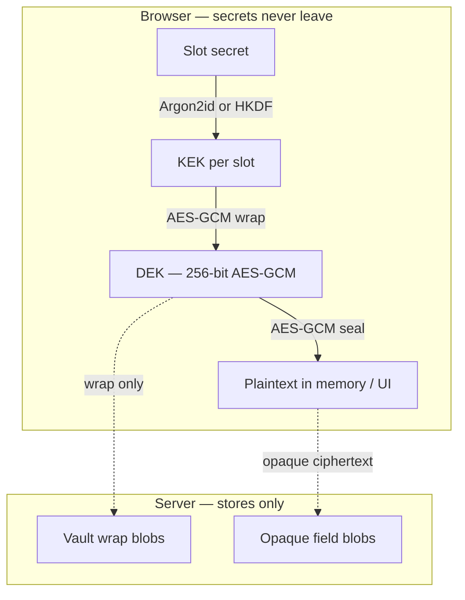
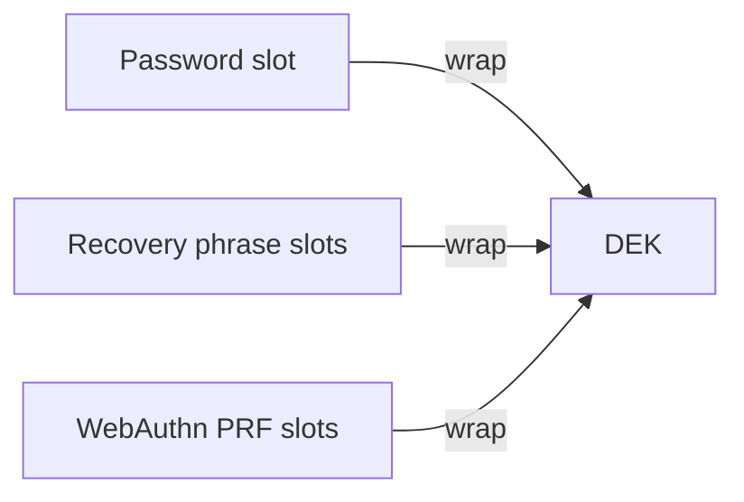
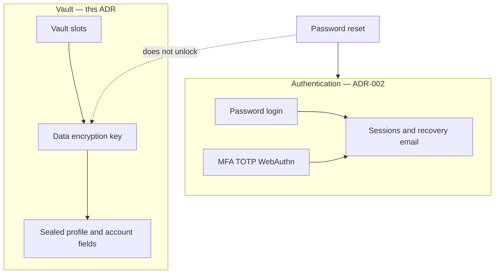
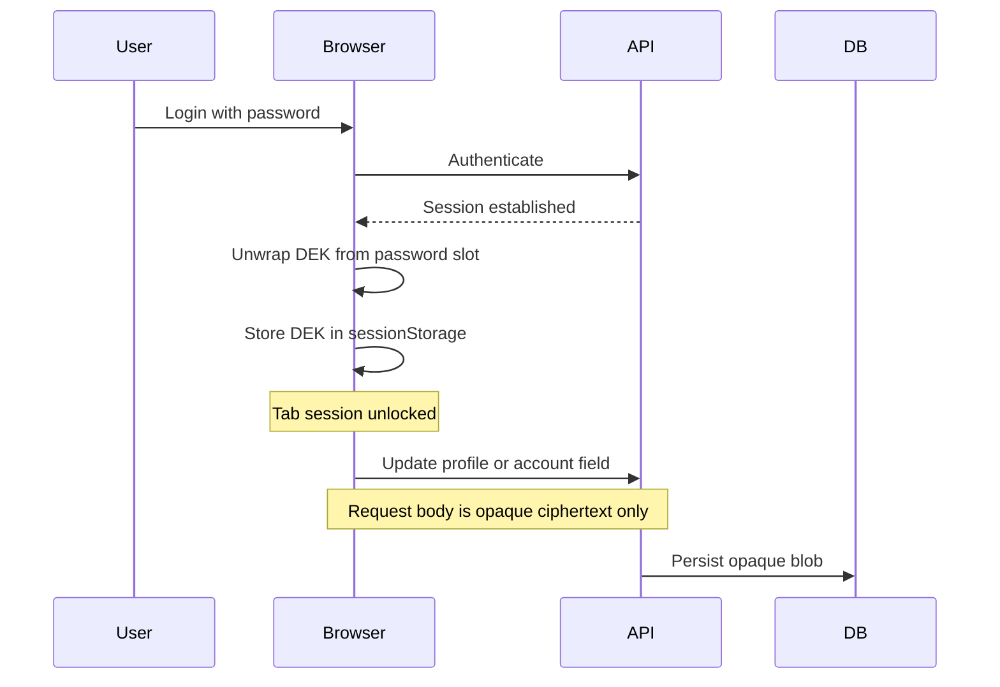

# ADR-003: End-to-End Encryption

## Status

Accepted

## Context

Sensitive application data must remain confidential even if a host operator can read the database, on-disk storage, or configuration. [ADR-002](002-authentication.md) covers authentication; this ADR defines the **client-side encryption boundary**.

Constraints:

- The server must never see plaintext of E2E fields or the data encryption key (DEK).
- Unlock once per browser session; reuse the DEK from session storage for edits.
- Resetting the login password does **not** decrypt data sealed to prior wraps.
- Users may protect the same DEK with password, recovery phrase, and/or passkey (WebAuthn PRF) slots; at least one slot is required for a vault.

## Decision

### Confidentiality Boundary

| Party | Role | Can decrypt E2E fields? |
| ----- | ---- | ----------------------- |
| Browser client | Holds session DEK; plaintext only in memory/UI | Yes, after unlock |
| Server | Stores opaque blobs and vault wraps | No |

Login identity, roles, MFA flags, and TOTP secrets (server-encrypted per ADR-004) are **not** E2E. Recovery email is stored as a **hash** for verification only.

### Key Hierarchy

1. **DEK** — random 256-bit AES-GCM key, generated in the browser.
2. **KEK per vault slot** — derived from that slot's secret; wraps the DEK.
3. **Fields** — AES-GCM sealed with the DEK; stored as opaque text.

### Vault Slots

| Slot type | Secret source | Notes |
| --------- | ------------- | ----- |
| Password | Login password | At most one per user |
| Recovery phrase | BIP39 mnemonic | Plaintext never leaves the browser; multiple slots allowed |
| WebAuthn PRF | Passkey PRF output | One slot per credential |

Every slot type is optional; a vault exists when the user has at least one slot.

### Auth vs Vault

Password reset restores **authentication only**. Data recovery requires a surviving vault slot.

### Session Unlock

While unlocked, API updates send opaque blobs only. Creating, rotating, or deleting slots requires appropriate proof (password, elevated session, or passkey).

### Wire Format

Vault wraps and optional sealed fields use `{nonce_base64url}.{ciphertext_base64url}`. The server validates wrap shape for vault rows; tier-1 profile and account fields are stored as opaque text with length checks only.

### Advanced Recovery

When recovery email is enrolled and a recovery-phrase or passkey slot exists, the user completes advanced recovery: email token → client unlocks the DEK → optionally re-wraps the password slot → MFA cleared. Plaintext recovery phrases in API bodies are rejected.

### Residuals

| Risk | Mitigation |
| ---- | ---------- |
| XSS while vault unlocked | Clear DEK on logout; CSP |
| Stolen session mutating slots | Per-slot proof requirements |
| Offline wrap guessing | Argon2id / BIP39 entropy |
| Lost all slot secrets | Permanent data loss (true E2EE trade-off) |

## Consequences

### Positive

- Sensitive data stays confidential against database and config access.
- Multiple unlock paths (password, phrase, passkey).

### Negative

- Lost all slot secrets means permanent data loss.
- Correct client crypto is mandatory; the server cannot recover plaintext.

## References

- [ADR-002](002-authentication.md) — authentication and recovery ceremonies
- [ADR-004](004-data-encryption-policy.md) — tier-1 classification
