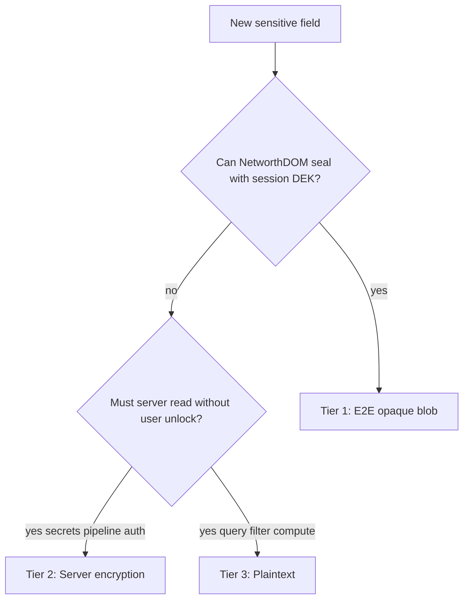

# ADR-004: Data Encryption Policy

## Status

Accepted

## Context

NetworthDB is a single consolidated backend: authentication, accounts, pipeline jobs,
integrations, and on-disk artifacts share one Postgres database (and tenant file
storage). That concentration increases the volume of sensitive data in one store. We
need one policy that answers: **how should each field or blob be protected?**

Related ADRs cover slices of this problem but not the full classification:

- [ADR-003](003-end-to-end-encryption.md) — E2E mechanics (DEK, vault slots, blob format).
- [ADR-002](002-authentication.md) — authentication, sessions, hashed recovery email.

This ADR defines the **tier order** for all data at rest and on disk. Default
posture: **encrypt as much as possible**.

## Decision

### Tier order (mandatory for new fields)

Apply tiers in priority order. Do not skip to a lower tier without documenting why.

### Tier definitions

| Tier | Name | Mechanism | Who can decrypt |
| ---- | ---- | --------- | --------------- |
| 1 | **End-to-end (E2E)** | Client may encrypt with the session DEK; server stores opaque text and is **encryption-agnostic** (length validation only). Vault slot wraps use per-slot KEKs and `nonce.ct` transport format. | User in the browser after vault unlock. Server and DB operator cannot decrypt tier-1 field contents. |
| 2 | **Server encryption** | Server encrypts at rest before persistence. All tier-2 blobs use **NWENC1** (AES-256-GCM). Financial/user blobs use a per-user data key wrapped by `FILESTORE_SECRET`. TOTP at rest uses the same NWENC1 format keyed by `MFA_SECRET`. | Operator with database access **and** the relevant env key. |
| 3 | **Plaintext** | Stored as a normal column or JSON field. | Anyone with database access. |

**Default for new sensitive fields:** tier 1 if the browser can seal it; else tier 2.
Tier 3 requires an explicit justification (query, index, or server must read without
user unlock).

### Hashing

Some values are **hashed** for verification only — not encrypted, not E2E-wrapped.
The server never needs to recover plaintext.

| Data | Mechanism |
| ---- | --------- |
| Login password | Argon2id (`users.password_hash`) |
| Recovery email | Argon2id hash (`users.recovery_email_hash`) |
| Session / MFA / recovery tokens | SHA-256 of opaque tokens |
| WebAuthn credential | `public_key` stored as public material (not secret) |

Do not apply NWENC1 or E2E to hashed fields.

### Environment gate (`ENVIRONMENT`)

Tier-2 encryption (NWENC1 for Postgres blobs and on-disk statement files) is
**enabled when `ENVIRONMENT=production`** and **disabled when `ENVIRONMENT=local`**.

| `ENVIRONMENT` | Tier-2 DB blobs | On-disk statement files | `FILESTORE_SECRET` | `MFA_SECRET` |
| ------------- | --------------- | ----------------------- | ------------------ | ------------ |
| `local` | Plaintext JSON in Postgres | Plaintext under tenant root | Optional | Required |
| `production` | NWENC1 + per-user data key | NWENC1 (`.vault/*.nwenc`) | Required | Required |

There is no separate flag to disable file encryption in production. Local plaintext
is a developer convenience only.

**Exceptions (always encrypted):** TOTP secrets use `MFA_SECRET` in all
environments per ADR-002. The key is **required** even when `ENVIRONMENT=local`.

Implementation of the environment gate for files is phased in
[`@ndb/statements`](../../src/packages/statements/) (see [ADR-005](005-statements-compute.md)
and [PLAN.md](../../PLAN.md)).

### Field inventory

Current storage classified by tier. On-disk statement artifacts are **implemented**
in `@ndb/statements` (Phase 2).

#### Tier 1 — E2E (client-sealed; server encryption-agnostic)

| Location | Fields | Notes |
| -------- | ------ | ----- |
| `users` | `display_name` | Opaque text from client; no blob-shape validation on server |
| `users_vault` | `salt`, `wrap_blob`, `credential_id` | Wrapped DEK per slot; see ADR-003 |
| `accounts` | `account_number` | Opaque text from client; no blob-shape validation on server |

#### Tier 2 — Server encryption

| Location | Fields | Notes |
| -------- | ------ | ----- |
| `users` | `encryption_secret` | Per-user data key wrapped with master key |
| `users` | `totp_secret`, `totp_pending` | NWENC1 blobs (`MFA_SECRET`) |
| `accounts` | `secrets` | NWENC1 JSON: PDF passwords, mail/statement rules |
| `sources` | `sources_config` | IMAP passwords and statement source settings |
| `jobs` | `output`, `error`, `logs` | Encrypted job stdout/stderr and debug traces |
| On disk | `.vault/*` (plaintext local) / `.vault/*.nwenc` (production) | Statement artifacts per user via `@ndb/statements` file store |

Implementation: [`@ndb/encryption`](../../src/packages/encryption/) (NWENC1 primitive),
[`encryption.ts`](../../src/packages/database/src/encryption.ts) (per-user key lifecycle).

#### Tier 3 — Plaintext (with justification)

| Location | Fields | Justification |
| -------- | ------ | ------------- |
| `users` | `username`, `role`, `multifactor_enabled`, timestamps, MFA lockout counters | Admin list, login lookup, policy enforcement |
| `accounts` | `account_type`, `bank`, `variant`, `label`, `opening_date`, `closing_date` | List/filter; pipeline reads bank/variant/dates without user unlock |
| `jobs` | `stage`, `status`, `job_scope`, `job_scope_key` | Job queue indexing and conflict detection |
| `auth_*` | ceremony metadata, expiry, AMR/ACR | Session and MFA orchestration (tokens themselves are hashed) |

#### Hashed / public

| Location | Fields |
| -------- | ------ |
| `users` | `password_hash`, `recovery_email_hash` |
| `auth_sessions` | `session_hash`, `refresh_hash` |
| `auth_multifactor` | `token_hash` |
| `auth_multifactor_codes` | `code_hash` |
| `auth_recovery` | `secret_hash` |
| `auth_webauthn_creds` | `credential_id`, `public_key`, `sign_count` |

### Review rule

Pull requests that add columns or encrypted blobs must state the **tier** and
**justification** in the Drizzle schema comment or PR description. Non-obvious tier 3
choices need a one-line reason.

### Non-goals

- Encrypting `username`, `role`, or `account_type` (required for admin and list APIs).
- Replacing hashes with encryption for passwords or recovery email.
- Duplicating E2E vault API detail (see ADR-003).

## Consequences

### Positive

- One decision tree for Phase 2+ (integrations, jobs, files, backup).
- Clear boundary: operator with `FILESTORE_SECRET` vs user with vault DEK.
- Aligns Phase 1 `accounts` design (opaque `account_number` + server-encrypted secrets + plaintext metadata).

### Negative

- Account metadata (`bank`, dates, `label`) remains readable to a DB operator — accepted so the statement pipeline can run without the user unlocking the vault.
- Two server key domains (`FILESTORE_SECRET` and `MFA_SECRET`) must be managed separately.

### Neutral

- ADR-003 describes client-side sealing; this ADR references it for tier 1 only.
- NetworthDOM may implement tier 1 sealing; server stores opaque text without encryption awareness and implements tier 2 in `@ndb/database`.

## Alternatives Considered

### Encrypt all account metadata at rest (tier 2)

Rejected. The pipeline must read `bank`, `variant`, and dates to match statements and
schedule jobs without requiring an active browser session with an unlocked DEK.

### E2E for PDF passwords and IMAP credentials

Rejected. The server must decrypt these in-process to run extract/cleanup/parse and
connect to mailboxes. Tier 2 (NWENC1 + user data key) is the correct choice.

### Single master key for everything

Rejected. TOTP secrets are auth infrastructure and use `MFA_SECRET` per
ADR-002. Financial blobs use per-user data keys so compromise of one user's material
does not decrypt another user's secrets.

## References

- [ADR-002: Authentication](002-authentication.md) — sessions, MFA, hashing
- [ADR-003: E2E encryption](003-end-to-end-encryption.md) — vault, DEK, blob format
- [ADR-005: Statement compute](005-statements-compute.md) — file layout and environment gate
- [`src/packages/encryption/`](../../src/packages/encryption/) — NWENC1 (`@ndb/encryption`)
- [`src/packages/core/src/domains/user/modules/vault/entities/vault-slot.ts`](../../src/packages/core/src/domains/user/modules/vault/entities/vault-slot.ts) — vault slot validation and wrap blob wire format
