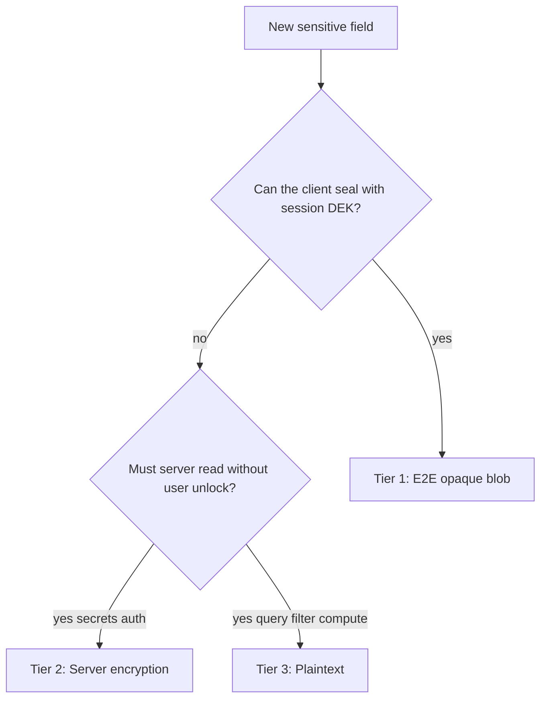
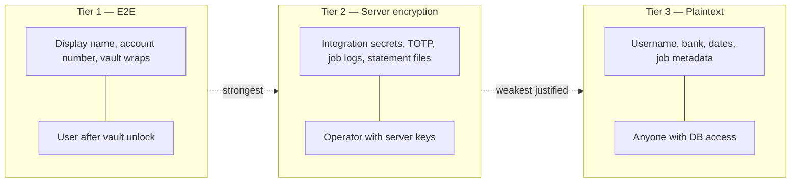
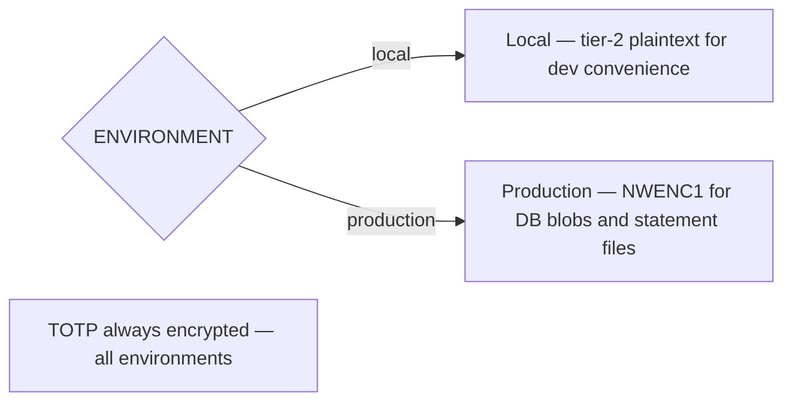

# ADR-004: Data Encryption Policy

## Status

Accepted

## Context

Authentication, accounts, jobs, integrations, and on-disk artifacts share one database and tenant storage. We need a single policy: **how should each field or blob be protected?**

[ADR-003](003-end-to-end-encryption.md) defines E2E mechanics. [ADR-002](002-authentication.md) covers auth-specific hashing and MFA secrets. This ADR defines the **tier order** for all data at rest.

Default posture: **encrypt as much as possible**.

## Decision

### Tier Order (Mandatory for New Fields)

Apply tiers in priority order. Do not skip to a lower tier without documenting why.

### Tier Landscape

### Tier Definitions

| Tier | Name | Mechanism | Who can decrypt |
| ---- | ---- | --------- | --------------- |
| 1 | **End-to-end** | Client encrypts; server stores opaque text (length validation only). Vault wraps use per-slot KEKs. | User in browser after vault unlock |
| 2 | **Server encryption** | AES-256-GCM (NWENC1). Financial blobs use a per-user data key wrapped by a filestore master key. TOTP uses a separate MFA master key. | Operator with DB access **and** the relevant env key |
| 3 | **Plaintext** | Normal column or JSON | Anyone with DB access |

**Default for new sensitive fields:** tier 1 if the browser can seal it; else tier 2. Tier 3 requires explicit justification.

### Hashing (Not Encryption)

Some values are hashed for verification only — never encrypted or E2E-wrapped:

- Login password (Argon2id)
- Recovery email (Argon2id hash)
- Session, MFA, and recovery tokens (SHA-256 of opaque values)
- WebAuthn credentials (public key material stored as public data)

### Environment Gate

| Environment | Tier-2 DB blobs | On-disk statement files |
| ----------- | --------------- | ----------------------- |
| Local | Plaintext JSON | Plaintext under tenant root |
| Production | NWENC1 + per-user data key | NWENC1 artifacts |

**Always encrypted:** TOTP secrets use the MFA master key in all environments.

### Field Classification

**Tier 1 — E2E:** user display name, account number, vault slot wraps.

**Tier 2 — Server encryption:** per-user encryption secret, TOTP secrets, account integration secrets (PDF passwords, mail rules), source credentials, job output/error/logs, on-disk statement vault files (production).

**Tier 3 — Plaintext (justified):** usernames, roles, MFA flags, account type/bank/variant/label/dates (pipeline and list APIs need these without vault unlock), job queue metadata, auth ceremony metadata.

**Hashed:** password hash, recovery email hash, session and token hashes.

### Review Rule

Pull requests that add columns or encrypted blobs must state the **tier** and **justification** in the schema comment or PR description.

### Non-Goals

- Encrypting usernames, roles, or account types needed for admin and list APIs.
- Replacing hashes with encryption for passwords or recovery email.
- Duplicating vault API detail (see ADR-003).

## Alternatives Considered

| Alternative | Why rejected |
| ----------- | ------------ |
| Encrypt all account metadata (tier 2) | Pipeline must read bank, variant, and dates without an unlocked browser session |
| E2E for PDF passwords and IMAP credentials | Server must decrypt in-process to run pipelines and connect to mail |
| Single master key for everything | TOTP is auth infrastructure; financial blobs use per-user keys for blast-radius isolation |

## Consequences

### Positive

- One decision tree for new fields, jobs, files, and backups.
- Clear boundary: operator with server keys vs user with vault DEK.

### Negative

- Account metadata remains readable to a DB operator — required for unattended statement processing.
- Two server key domains (filestore and MFA) must be managed separately.

## References

- [ADR-002](002-authentication.md) — sessions, MFA, hashing
- [ADR-003](003-end-to-end-encryption.md) — vault, DEK, blob format
- [ADR-005](005-statements-compute.md) — on-disk statement vault
